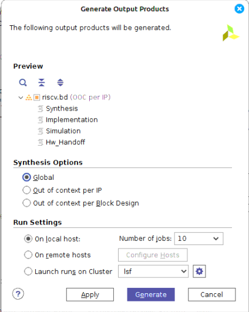

# vivado-risc-v

# AMD/Xilinx Vivado block designs for FPGA RISC-V SoC running Debian Linux distro.

This repository contains FPGA prototype of fully functional [RISC-V](https://riscv.org/) Linux server
with networking, online Linux package repository and daily package updates.
It includes scripts and sources to generate RISC-V SoC HDL, AMD/Xilinx Vivado project, FPGA bitstream, and bootable SD card.
The SD card contains [RISC-V Open Source Supervisor Binary Interface (OpenSBI)](https://github.com/riscv/opensbi), [U-Boot](https://github.com/u-boot/u-boot), [Linux kernel](https://git.kernel.org/pub/scm/linux/kernel/git/stable/linux.git/) and [Debian root FS](https://wiki.debian.org/RISC-V).
Linux package repositories and regular updates are provided by [Debian](https://wiki.debian.org/RISC-V).
Over 90% of packages of the whole Debian collection are available for download.

Also can be used to run [bare-metal](https://github.com/eugene-tarassov/vivado-risc-v/tree/master/bare-metal) or RTOS software.

The project is used as reference design to validate RISC-V support in [Eclipse TCF](https://wiki.eclipse.org/TCF/RISC-V).

AMD/Xilinx tools support debugging of RISC-V software over JTAG.

# Prerequisites for DRAM Discharge

## Hardware
[Digilent Genesys 2](https://digilent.com/reference/programmable-logic/genesys-2/start)


## Workstation
[Ubuntu 20 LTS](https://ubuntu.com/download/desktop) machine with min 32GB RAM is recommended.
sudo access required.

Alternatively, a Windows 10 machine with Ubuntu on Windows can be used to run the tools, see [Running RISC-V tools on Windows](docs/ubuntu-on-windows.md).

## Software
Download and install AMD/Xilinx 2019.2

If using a Digilent board, install [Vivado Board Files for Digilent FPGA Boards](https://github.com/Digilent/vivado-boards).

### Adding Genesys2 Support in Vivado

```bash
cd ~
git clone https://github.com/Digilent/vivado-boards.git
source $path_to_vivado_2019.2_install/setthings64.sh
#Get board files to be recognized by Vivado 2019.2 itself
echo "set_param board.repoPaths {~/vivado-boards/new/board_files/genesys2/H}" >> $HOME/.Xilinx/Vivado/2019.2/Vivado_init.tcl
#Open Vivado
vivado
#in Vivado
set_param board.repoPaths {$HOME/.Xilinx/Vivado/2019.2/xhub/board_store ~/vivado-boards}
```

# Usage to disable DRAM Refresh 

## Checkout the repository, install required packages and update submodules
```
sudo apt install git make
git clone https://github.com/eugene-tarassov/vivado-risc-v.git
cd vivado-risc-v
make apt-install
make update-submodules
```

## Build FPGA Project
```
make CONFIG=rocket64b2 BOARD=genesys2 project
```

## Disabling DRAM Auto-Refresh

To disable automatic DRAM refresh via the Memory Interface Generator (MIG):

### Step 1: Modify MIG RTL

Edit the following file:

```
/workspace/rocket64b2/vivado-genesys2-riscv/genesys2-riscv.srcs/sources_1/bd/riscv/ip/riscv_mig_7series_0_0/\
riscv_mig_7series_0_0/user_design/rtl/controller/mig_7series_v4_2_mc.v
```

Locate the `USER_REFRESH` parameter and set it to `"ON"`:

```verilog
.USER_REFRESH("ON")
```

### Step 2: Set Global Synthesis Context in Vivado

To ensure that your changes to the MIG RTL are included:

1. In Vivado, right-click on **"Generate Block Design"**.
2. Under **Synthesis Options**, choose **"Global"** instead of the default **Out-of-Context**.

This ensures Vivado re-synthesizes the full design with your RTL modifications.



### Step 3: Generate Bitstream and Program the Board


## Prepare the SD card
Use USB SD card reader to connect SD card to the workstation, and run:
```
./mk-sd-card
```
The script looks for USB memory device and asks confirmation before using it.
Make sure to confirm right SD card device - all old data will be erased.

## Booting Linux with QEMU (optional)
In some cases when Linux runs slow on the FPGA, especially designs with lower clock speeds or no ethernet access), it might be worth it to first install the dependencies quickly before running it on FPGA.

You can run the following:
```
./qemu/boot_qemu.sh
```

The script will check for the existance of a debian image under `debian-riscv64/` and run `./mk-sd-image` as needed. Then it will clone and make a suitable version of u-boot and opensbi for QEMU before finally booting Linux.

Once Linux has booted successfully on QEMU, you can also easily ssh and scp too:
```
ssh -p2222 debian@localhost
```

Once all this is done, you can make the sd card without making the image:
```
./mk-sd-card skip_mk_img
```

## Program the FPGA flash memory
```
source /opt/Xilinx/Vivado/2024.2/settings64.sh
make CONFIG=rocket64b2 BOARD=nexys-video flash
```
Alternatively, [flash memory can be programmed using Vivado GUI](docs/vivado-flash.md).

## Linux login

Host name: debian

User login and password: debian debian

Root login and password: root root

You can login over UART console:
```
sudo miniterm /dev/ttyUSB0 115200
```
or, after Linux boot, over SSH:
```
ssh debian@debian
```
